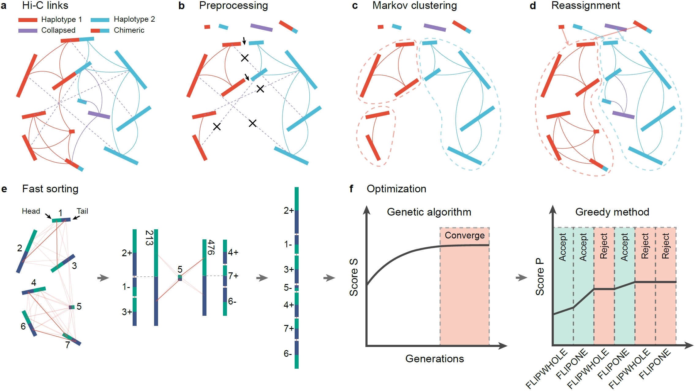
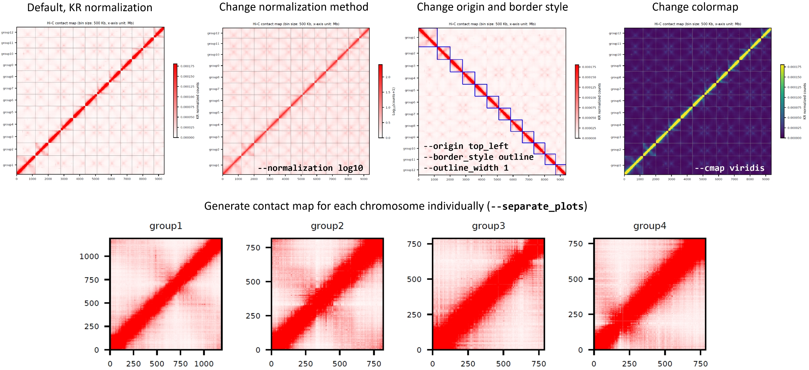
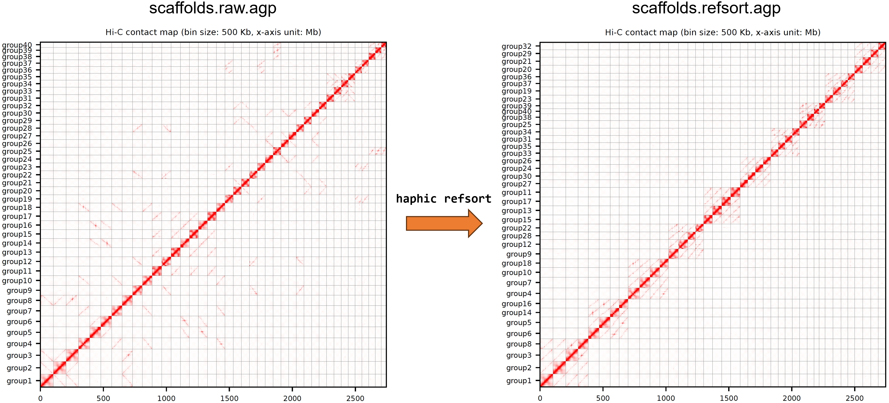

## HapHiC：一款基于Hi-C数据的快速、不依赖参考基因组的单倍型分型挂载工具




<p align="center"><strong>[ <a href="./README.md">English</a> | 简体中文 ]</strong></p>

HapHiC是一款利用Hi-C数据将单倍型分型的基因组组装挂载至染色体水平伪分子的挂载工具。与另一款同类工具[ALLHiC](https://github.com/tangerzhang/ALLHiC)不同，HapHiC无需参考基因组即可完成该过程。我们的评估结果表明，HapHiC对低contig N50、低深度的Hi-C测序数据以及各类组装错误具有更高容忍度，其性能优于其他Hi-C挂载工具。此外，该工具运行速度极快，也适用于单倍型塌缩的二倍体及异源多倍体基因组组装。

**功能特性:**

- [x] 无需参考基因组即可实现染色体水平单倍型分型挂载
- [x] 高效纠正嵌合contig（错误连接），同时对contig N50影响极小
- [x] 对嵌合contig、塌缩contig以及交换错误拥有极高容忍度
- [x] 显著提升contig染色体分配的准确性
- [x] 显著提升contig排序与定向的准确性
- [x] 超快的运行速度以及低内存占用
- [x] 无需预先知道染色体数即可完成contig的排序与定向（快速查看模式）
- [x] 能够以不同置信度利用hifiasm的单倍型分型信息
- [x] 广泛的兼容性与用户友好的界面：支持chromap；提供内置的一键化流程；能够生成高度可定制的Hi-C互作热图的矢量图

**近期更新:**

* 版本 1.0.7 (2025.03.28)：HapHiC现在可支持更长的contig（2^63-1 bp）。不过一些上下游工具（比如bwa和Juicebox）可能仍不支持长度超过2^31-1 bp的contig。
* 版本 1.0.6 (2024.08.26)：不再需要在Juicebox中设置缩放因子（scale factor）。此外，保存的`.review.assembly`文件 现在可以被Juicebox正确解析。
* 版本 1.0.5 (2024.07.05)：通过对比快速排序和ALLHiC优化结果，改进了contig排序和定向和稳定性。
* 版本 1.0.4 (2024.07.03)：新增`haphic refsort`命令，用于[根据参考基因组对整个scaffold进行排序与定向](#refsort)。
* 版本 1.0.3 (2024.03.21)：新增对[chromap](https://github.com/haowenz/chromap)工具所采用的[pairs格式](https://github.com/4dn-dcic/pairix/blob/master/pairs_format_specification.md)的支持。
* 版本 1.0.2 (2023.12.08)：引入`haphic plot`命令，用于[Hi-C互作热图可视化](#visualization)。
* 版本 1.0.1 (2023.11.30)： 通过引入YaHS风格的`scaffolds.raw.agp`文件改进了AGP输出，以兼容YaHS建议的[Juicebox可视化](#juicebox)方法。

**术语说明:** 为确保简洁明了，我们使用“contig”一词来指代输入的组装文件中的片段化基因组序列，尽管在实际情况下它们可能是contig或scasffold。


## 目录

- [安装](#installation)
- [快速入门](#quick_start)
  * [将Hi-C数据比对至组装结果](#align)
  * [运行HapHiC挂载流程](#pipeline)
- [进阶：分步执行流程](#step_by_step)
  * [[步骤1] 聚类](#step1)
  * [[步骤2] 重分配](#step2)
  * [[步骤3] 排序与定向](#step3)
  * [[步骤4] 构建scaffold](#step4)
- [案例](#examples)
- [与hifiasm配合使用](#hifiasm)
- [快速查看模式](#quick_view)
- [Juicebox人工调整](#juicebox)
- [可视化](#visualization)
- [使用参考基因组对scaffold进行整体排序和定向](#refsort)
- [常见问题解答（FAQs）](#faqs)
- [问题与错误报告](#problems)
- [引用HapHiC](#citing)
- [可重复性](#reproduce)


## <span id="installation">安装</span>

HapHiC已经在配备了Intel Xeon、AMD EPYC或Hygon C86 CPU的Linux服务器上进行测试和验证。如果您能提供龙芯等国产CPU环境的服务器，我们很乐意进行测试并尝试适配。

```bash
# （1）从GitHub下载HapHiC
$ git clone https://github.com/zengxiaofei/HapHiC.git

# （2）解决依赖
# 我们强烈建议使用conda安装依赖。如果您想要手动安装，请参考HapHiC/conda_env/create_conda_env_py310.sh
# 我们在HapHiC/conda_env/目录下也为Python 3.11和3.12提供了适配的环境
$ conda env create -f HapHiC/conda_env/environment_py310.yml
# 激活HapHiC conda环境
$ conda activate haphic # 或者: source /path/to/conda/bin/activate haphic

# （3）检查是否所有依赖都已正确安装
$ /path/to/HapHiC/haphic check

# （4）显示所有可用的命令和帮助信息
$ /path/to/HapHiC/haphic -h
```
> [!NOTE]
> 请注意，**Bioconda版的HapHiC不是官方维护的，并且存在已知的会导致流程终止的问题**。为了确保顺利安装，请严格按照上面的方式安装HapHiC环境。


## <span id="quick_start">快速入门</span>

### <span id="align">将Hi-C数据比对至组装结果</span>


首先，您需要将Hi-C数据比对至FASTA格式的组装结果来准备一个BAM文件。下面是我们推荐的方法：

```bash
# （1）将Hi-C数据比对至组装结果, 移除PCR重复，并过滤掉次级（secondary）和补充（supplementary）比对
$ bwa index asm.fa
$ bwa mem -5SP -t 28 asm.fa /path/to/read1_fq.gz /path/to/read2_fq.gz | samblaster | samtools view - -@ 14 -S -h -b -F 3340 -o HiC.bam

# （2）使用MAPQ 1（比对质量≥1）和NM 3 （编辑距离<3）为阈值过滤比对结果
$ /path/to/HapHiC/utils/filter_bam HiC.bam 1 --nm 3 --threads 14 | samtools view - -b -@ 14 -o HiC.filtered.bam
```

> [!NOTE]
>
> * 此处`asm.fa`可以是单倍型塌缩的contig（如hifiasm中的`p_ctg`）、单倍型分型的unitig（如hifiasm中的`p_utg`），或一套/多套单倍型分型的contig（如hifiasm中的`hap*.p_ctg`）。此外，`asm.fa`也可能可以是其他挂载工具输出的scaffold。
> * 您可以根据自己的偏好或需求准备BAM文件，但**请勿**按坐标排序。若BAM文件已经按坐标排序，可以按照读序名称重新排序（使用`samtools sort -n`）。
> * 我们**不建议**使用Juicer流程进行Hi-C数据比对，尤其是在单倍型分型的组装中。

### <span id="pipeline">运行HapHiC挂载流程</span>

**（i）单行命令。** HapHiC提供可执行整个挂载流程的单行命令`haphic pipeline`，必需参数包括： 

1) `asm.fa`， FASTA格式的基因组组装结果。
2) `HiC.filtered.bam`，前面步骤中准备的BAM文件（自1.0.3版本起也支持chromap输出的.pairs文件）。
3) `nchrs`，基因组组装结果中的染色体数，也是最终输出的scaffold数。

```bash
$ /path/to/HapHiC/haphic pipeline asm.fa HiC.filtered.bam nchrs
```

**（ii）限制性酶切位点。** 默认酶切位点为`GATC`（MboI/DpnII），可以通过`--RE`参数修改。如果您不确定或Hi-C文库构建过程未使用限制性内切酶，保留默认值即可。

```bash
# 使用HindIII酶
$ /path/to/HapHiC/haphic pipeline asm.fa HiC.filtered.bam nchrs --RE "AAGCTT"
# 使用Arima双酶方案
$ /path/to/HapHiC/haphic pipeline asm.fa HiC.filtered.bam nchrs --RE "GATC,GANTC"
# 使用Arima四酶方案
$ /path/to/HapHiC/haphic pipeline asm.fa HiC.filtered.bam nchrs --RE "GATC,GANTC,CTNAG,TTAA"
```

**（iii）contig纠错。** 若需要基于Hi-C信号纠正错误连接的contig，使用`--correct_nrounds`参数开启组装纠错并设置纠错轮次。例如：

```bash
# 通常两轮纠正即可
$ /path/to/HapHiC/haphic pipeline asm.fa HiC.filtered.bam nchrs --correct_nrounds 2
```

**（iv） 交换错误（switch error）。** 若输入的是单倍型分型的组装结果但存在较高的交换错误率（常因单倍型间序列差异极小由上游组装软件引入），使用`--remove_allelic_links`移除等位contig间的Hi-C信号来提高对这种错误的容忍度。参数值应为组装结果的倍性。例如：

```bash
# 对于一个四倍体的单倍型分型组装结果，将这个参数设为4
$ /path/to/HapHiC/haphic pipeline asm.fa HiC.filtered.bam nchrs --remove_allelic_links 4
```

> [!NOTE]
>
> 若输入为单倍型分型组装且Hi-C数据通过chromap等其他方式比对，建议启用此参数以减轻比对错误的影响。

**（v）性能。** 使用`--threads`设置BAM文件读取的线程数，使用`--processes`为contig排序和定向创建多进程。例如：

```bash
$ /path/to/HapHiC/haphic pipeline asm.fa HiC.filtered.bam nchrs --threads 8 --processes 8
```

**参数说明**

略，运行`haphic pipeline --help`查看详细信息。

**最终输出文件**

* `01.cluster/corrected_asm.fa`：FASTA格式的纠错后的contig序列。该文件仅在启用组装纠错时生成。
* `04.build/scaffolds.agp`：[SALSA](https://github.com/marbl/SALSA)风格的[AGP文件](https://www.ncbi.nlm.nih.gov/assembly/agp/AGP_Specification/)，记录了`corrected_asm.fa`中所有序列的scaffold归属、排序及方向信息。若存在被HapHiC纠正的嵌合contig，打断后的contig会被分配新的ID。
* `04.build/scaffolds.raw.agp`：[YaHS](https://github.com/c-zhou/yahs)风格的AGP文件，记录了`asm.fa`中所有序列的scaffold归属、排序及方向信息。打断后的contig不会被分配新的ID，但其在原始contig中的起止坐标会显示在第7、8列。
* `04.build/scaffolds.fa`：FASTA格式的最终scaffold序列。
* `04.build/juicebox.sh`: 用于[Juicebox可视化与人工调整](#juicebox)的shell脚本。

> [!NOTE]
>
> 尽管单行命令操作便捷，但自动化的参数调优在某些时候可能会失败，极端情况下会导致结果不佳甚至流程中断。若遇此情况，建议[分步执行流程并手动调参](#step_by_step)，或尝试下文所述的[快速查看模式](#quick_view)。


## <span id="step_by_step">进阶：分步执行流程</span>

### <span id="step1">[步骤1] 聚类</span>

在聚类之前，HapHiC会进行预处理以纠正组装中的错误连接、过滤短的或者错误组装的contig，并移除等位序列间的Hi-C信号。随后，采用马尔可夫聚类算法（[MCL算法](https://micans.org/mcl/)）将contig聚类成组。与指定聚类数量的凝聚层次聚类（AHC，LACHESIS和ALLHiC采用的方法）不同，MCL算法通过“inflation”参数隐式地控制聚类数量——该参数值越高，聚类生成的组越多。AHC的主要问题在于：即便指定了聚类数量，不同染色体的contig仍可能被错误归入同一组，这种情况在单倍型分型的二倍体或多倍体基因组组装中尤为常见。为此，HapHiC通过尝试一系列inflation值（由`--min_inflation`、`--max_inflation`和`--inflation_step`控制）进行contig聚类，并根据用户提供的预期染色体数量`nchrs`与聚类组的长度分布推荐“最佳”参数。

```bash
$ /path/to/HapHiC/haphic cluster asm.fa HiC.filtered.bam nchrs
```

**参数说明**

略，运行`haphic cluster --help`查看详细信息。

**主要输出文件**

* `corrected_asm.fa`：FASTA格式的纠错后的contig序列。该文件仅在启用组装纠错时生成。

* `corrected_ctgs.txt`：记录所有纠错contig ID的文本文件。

* `full_links.pkl`： 储存contig间Hi-C连接数的二进制文件。

* `HT_links.pkl`：记录contig头尾间Hi-C连接数的二进制文件。

* `paired_links.clm`：保存成对Hi-C连接位置信息的文本文件。

* `inflation_*`： 各inflation值的输出目录。

  ├── `group*.txt`：包含各组contig ID及其基本信息的文件（包括长度和限制性酶切位点数），在ALLHiC中称为`counts_RE.txt`。

  └── `mcl_inflation_*.clusters.txt`：马尔可夫聚类结果。

**“最佳”inflation值**

您可以在日志文件`HapHiC_cluster.log`中找到推荐的“最佳”inflation值，例如：

```
2022-11-07 17:50:08 <HapHiC_cluster.py> [recommend_inflation] You could try inflation from 1.20 (length ratio = 0.75)
```

在某些时候，HapHiC无法找到“最佳”inflation。着可能是由于参数设置不当或者组装错误过多。此时应先检查所用参数是否正确或合适，然后尝试调整组装纠错、contig/Hi-C信号过滤或马尔可夫聚类的相关参数：

```
2022-11-19 13:20:38 <HapHiC_cluster.py> [recommend_inflation] It seems that some chromosomes were grouped together (length ratio = 0.5)...
```

### <span id="step2">[步骤2] 重分配</span>

在前一步骤中，部分contig可能在聚类前被过滤或分配到错误的组。此外，马尔可夫聚类输出的最终组数可能超过设定的染色体数（`nchrs`）。为解决这些问题，我们增加了重分配步骤，以回收未分组的contig、纠正错误分组的contig，并在必要时通过凝聚层次聚类合并分组。输入文件`full_links.pkl`、`mcl_inflation_x_.clusters.txt`和`paired_links.clm`是聚类步骤的输出文件，其中`x`代表“最佳”inflation值：

```bash
$ /path/to/HapHiC/haphic reassign asm.fa full_links.pkl mcl_inflation_x.clusters.txt paired_links.clm --nclusters nchrs
```

> [!NOTE]
>
> 若已进行组装纠错，需使用`corrected_asm.fa`代替`asm.fa`作为输入FASTA文件。 

**参数说明**

略，运行`haphic reassign --help`查看详细信息。

**主要输出文件**

* `final_groups/group*.txt`: 包含重分配后最终分组中contig ID及基础信息的文件。
* `final_groups/final_cluster.txt`：最终聚类结果文件。
* `split_clms/`：存储各组CLM文件的目录。

### <span id="step3">[步骤3] 排序与定向</span>

HapHiC中的排序与定向步骤通过整合[3D-DNA](https://github.com/aidenlab/3d-dna)和[ALLHiC](https://github.com/tanghaibao/allhic)的算法实现。首先，采用效率优化后的3D-DNA迭代挂载算法（称为“快速排序”）对contig进行排序和定向。随后，将contig的排序和定向结果作为初始状态输入ALLHiC程序进行优化（一个修复了热启动问题的[改良版](http://github.com/zengxiaofei/allhic)）。输入文件`HT_links.pkl`来自聚类步骤的输出，目录`split_clms`和分组文件`final_groups/group*.txt`则在重分配步骤创建。可选参数`--processes`用于设置排序与定向的并行进程数。

```bash
$ /path/to/HapHiC/haphic sort asm.fa HT_links.pkl split_clms final_groups/group*.txt --processes 8
```

> [!NOTE]
>
> 若已进行组装纠错，需使用`corrected_asm.fa`代替`asm.fa`作为输入FASTA文件。

**参数说明**

略，运行`haphic sort --help`查看详细信息。

**主要输出文件**

* `group*.tour.sav`：各分组内contig的快速排序结果。
* `group*.tour`：经ALLHiC优化后的contig排序与定向结果。
* `final_tours/group*.tour`：最终contig排序与定向结果。

### <span id="step4">[步骤4] 构建scaffold</span>

最终步骤是根据`group*.tour`文件中contig的染色体归属、排序和方向信息构建scaffold（伪分子）。默认参数下，输出的scaffold按长度排序。

**若未进行组装纠错：**

```bash
$ /path/to/HapHiC/haphic build asm.fa asm.fa HiC.filtered.bam final_tours/group*.tour
```

**若已进行组装纠错：**

使用`corrected_asm.fa`代替**第一个** `asm.fa`作为输入的FASTA文件，并通过`--corrected_ctgs`参数指定纠错contig列表`corrected_ctgs.txt`。否则，生成的YaHS风格的scaffolds.raw.agp`文件可能是错的。

```bash
$ /path/to/HapHiC/haphic build corrected_asm.fa asm.fa HiC.filtered.bam final_tours/group*.tour --corrected_ctgs corrected_ctgs.txt
```

> [!NOTE]
>
> 自HapHiC 1.0.1版本起，第二个`asm.fa`（原始未纠错的组装文件）和`HiC.filtered.bam`是必须提供的，以生成用于Juicebox可视化与人工调整的shell脚本。

**参数说明**

略，运行`haphic build --help`查看详细信息。

**主要输出文件**

* `scaffolds.agp`：[SALSA](https://github.com/marbl/SALSA)风格的[AGP文件](https://www.ncbi.nlm.nih.gov/assembly/agp/AGP_Specification/)，记录了`corrected_asm.fa`中所有序列的scaffold归属、排序及方向信息。若存在被HapHiC纠正的嵌合contig，打断后的contig会被分配新的ID。
* `scaffolds.raw.agp`：[YaHS](https://github.com/c-zhou/yahs)风格的AGP文件，记录了`asm.fa`中所有序列的scaffold归属、排序及方向信息。打断后的contig不会被分配新的ID，但其在原始contig中的起止坐标会显示在第7、8列。
* `scaffolds.fa`：FASTA格式的最终scaffold序列。
* `juicebox.sh`: 用于[Juicebox可视化与人工调整](#juicebox)的shell脚本。


## <span id="examples">案例</span>

HapHiC可在**1小时内**（仅使用8个CPU核心）完成大多数基因组的挂载。对于含有碎片化contig的大型基因组，挂载过程通常不超过半天。HapHiC已成功在多个分类群的基因组中得到验证，包括高等植物、人类、鸟类、两栖动物、鱼类、昆虫、软体动物和环节动物等。更多案例及详细信息请参阅我们[论文](https://doi.org/10.1038/s41477-024-01755-3)中的[补充材料](https://static-content.springer.com/esm/art%3A10.1038%2Fs41477-024-01755-3/MediaObjects/41477_2024_1755_MOESM1_ESM.pdf)。

| 物种          | 核型    | 单倍型分型 | 基因组大小（Gb） | Contig N50 （Mb） | Contig数 | 过滤后Hi-C深度 | 运行时间 （分钟） | 峰值内存（GiB） |
| :-------------------: | :----------: | :----------------: | :----------------: | :-------------: | :---------------: | :------------------------: | :-------------: | :------------: |
| 奇岗 | 2*n*=3*x*=57 | 是                | 6.11               | 2.19            | 5,761             | 33.58×                     | 115.35          | 17.10          |
| 马铃薯（合作88）  | 2*n*=4*x*=48 | 是               | 3.16               | 18.78           | 2,490             | 13.4×                      | 20.15           | 5.98           |
| 甘蔗割手密种（Np-X） | 2*n*=4*x*=40 | 是               | 2.76               | 0.38            | 15,510            | 23.7×                      | 78.97           | 27.02          |
| 苜蓿（新疆大叶） | 2*n*=4*x*=32 | 是               | 3.16               | 0.46            | 31,772            | 10.1×                      | 33.13           | 7.68           |
| 茶树（铁观音） | 2*n*=2*x*=30 | 是               | 5.99               | 0.22            | 60,345            | 9.8×                       | 157.53          | 33.68          |
| 人（HG002） | 2*n*=2*x*=46 | 是               | 6.02               | 73.40           | 1,153             | 4.7×                       | 13.42           | 11.50          |
| 小麦         | 2*n*=6*x*=42 | 否                 | 14.0               | 2.16            | 12,982            | 1.5×                       | 58.05           | 22.98          |
| 银杏          | 2*n*=2*x*=24 | 否                | 9.87               | 1.58            | 261,820           | 54.1×                      | 440.78          | 135.83         |
| 苍鹰     | 2*n*=2*x*=80 | 否                | 1.40               | 17.71           | 638               | 27.2×                      | 16.95           | 2.19           |
| 热带爪蟾 | 2*n*=2*x*=20 | 否                | 1.48               | 0.38            | 9,631             | 47.5×                      | 53.80           | 19.83          |
| 娇扁隆头鱼 | 2*n*=2*x*=46 | 否                | 0.64               | 1.19            | 1,774             | 85.3×                      | 25.73           | 3.13           |
| 柞蚕 | 2*n*=2*x*=98 | 否                | 0.73               | 0.17            | 9,824             | 70.8×                      | 35.33           | 10.66          |
| 某钟螺科物种   | 2*n*=2*x*=36 | 否                | 1.27               | 6.20            | 843               | 58.3×                      | 27.07           | 5.06           |
| 红正蚓   | 2*n*=2*x*=36 | 否                | 0.79               | 0.71            | 2,261             | 64.4×                      | 20.32           | 3.23           |


## <span id="hifiasm">与hifiasm配合使用</span>

在挂载分型的[hifiasm](https://github.com/chhylp123/hifiasm)组装结果时，您可以将hifiasm输出的GFA文件作为输入运行HapHiC。此处“分型的hifiasm组装”指通过trio binning或Hi-C数据分型的primary contig（`*.hap*.p_ctg.gfa`）以及分型的unitig（`*.p_utg.gfa`）。

HapHiC会利用GFA文件中的测序深度信息，在聚类前过滤潜在的塌缩contig/unitig。若提供多个GFA文件，HapHiC将默认这些文件对应不同单倍型（`*.hap*.p_ctg.gfa`）,并在聚类时根据其中的分型信息人为地去除或减弱单倍型间的Hi-C连接。需注意GFA文件中contig/unitig ID应与FASTA文件保持一致。输入`.gfa`或`noseq.gfa`文件均可。

```bash
# （1）对于hifiasm组装的unitig（`*.p_utg.gfa`），使用GFA文件中的测序深度信息在聚类前过滤潜在塌缩unitig
$ /path/to/HapHiC/haphic pipeline p_utg.fa HiC.filtered.bam nchrs --gfa p_utg.gfa

# （2）对于hifiasm组装的分型contig（`*.hap*.p_ctg.gfa`），除测序深度过滤外，HapHiC还能根据GFA文件中的分型信息减少单倍型之间的Hi-C连接

# 默认情况下，将完全去除单倍型之间所有Hi-C连接，确保来自不同单倍型的contig不会聚类至同组
$ /path/to/HapHiC/haphic pipeline allhaps.fa HiC.filtered.bam nchrs --gfa "hap1.p_ctg.gfa,hap2.p_ctg.gfa"

# 使用`--phasing_weight`参数控制对hifiasm分型结果的置信度。将权重设为0可完全忽略其分型信息。您也可以将参数设置在0-1之间来运行HapHiC（同时考虑hifiasm和HapHiC的分型结果），此时来自不同单倍型的contig可能会被聚类到一起
$ /path/to/HapHiC/haphic pipeline allhaps.fa HiC.filtered.bam nchrs --gfa "hap1.p_ctg.gfa,hap2.p_ctg.gfa" --phasing_weight 0
```

> [!NOTE]
>
> 该功能并不是必需的，您可以根据自己的需求来决定是否要使用`--gfa`参数。首先，即使没有输入GFA文件，HapHiC也可以根据Hi-C测序深度处理塌缩contig/unitig。其次，利用GFA文件中的分型信息人为去除单倍型之间的Hi-C连接会一定程度导致挂载率下降。


## <span id="quick_view">快速查看模式</span>

在遇到以下情况时，您可以尝试使用HapHiC的快速查看模式：

1. 不清楚确切的染色体数时。
2. HapHiC无法提供可接受的聚类结果或遇到流程中断时。
3. 需要快速查看您的组装情况（例如，识别错误组装的类型及大致比例）。
4. 想要在Juicebox中人工调整并自行划分染色体。

在快速查看模式下，HapHiC简单地使用快速排序算法为所有contig进行排序和定向，而不进行聚类操作。它的结果类似于[3D-DNA](https://github.com/aidenlab/3d-dna)输出的`*.0.hic`文件。此模式下大多数参数将被禁用，但您仍可通过`--correct_nrounds`参数对输入的contig进行纠错。在挂载单倍型分型的hifiasm组装结果（`*.hap*.p_ctg.gfa`）时，您依然可以使用各单倍型的GFA文件将contig划分到不同单倍型中。

```bash
# HapHiC将忽略`nchrs`参数，可填写任意整数
$ /path/to/HapHiC/haphic pipeline asm.fa HiC.filtered.bam nchrs --quick_view
# 快速查看模式下进行组装纠错
$ /path/to/HapHiC/haphic pipeline asm.fa HiC.filtered.bam nchrs --quick_view --correct_nrounds 2
# 快速查看模式下将contig划分不同单倍型
$ /path/to/HapHiC/haphic pipeline allhaps.fa HiC.filtered.bam nchrs --quick_view --gfa "hap1.p_ctg.gfa,hap2.p_ctg.gfa"
```


## <span id="juicebox">Juicebox人工调整</span>

有两种生成`.assembly`和`.hic`文件以用于Juicebox可视化和人工调整的方法。您可以根据自己的喜好从中选择一种，**不过我们更推荐第二种方法**。

#### (1) SALSA风格的`scaffolds.agp`

首先安装依赖，包括（1）[3D-DNA](https://github.com/aidenlab/3d-dna)、（2）[matlock](https://github.com/phasegenomics/matlock)、（3）[Juicebox scripts](https://github.com/phasegenomics/juicebox_scripts)。随后按照下述步骤生成`.assembly`和`.hic`文件：

```bash
# （1）生成.mnd文件
$ /path/to/matlock bam2 juicer HiC.filtered.bam out.links.mnd
$ sort -k2,2 -k6,6 out.links.mnd > out.sorted.links.mnd

# （2）生成.assembly文件
$ /path/to/juicebox_scripts/agp2assembly.py scaffolds.agp scaffolds.assembly

# （3）生成.hic文件
$ bash /path/to/3d-dna/visualize/run-assembly-visualizer.sh -p false scaffolds.assembly out.sorted.links.mnd
```

>  [!NOTE]
>
> 若存在经HapHiC纠错的contig，需将Hi-C数据重新比对至`corrected_asm.fa`并过滤，不可以直接使用原始的`HiC.filtered.bam`。否则，纠错后的contig在Juicebox中将没有任何Hi-C信号。这是因为SALSA风格的`scaffolds.agp`中纠错的contig ID与原始BAM文件不匹配。这也是不推荐该方法的原因。

您可以通过下面的命令行回忆起这些步骤:

```bash
$ /path/to/HapHiC/haphic juicer
```

经Juicebox人工调整后，将获得修改后的`scaffolds.review.assembly`文件。使用下面的命令生成最终的scaffold FASTA文件：

```bash
# 生成最终的scaffold FASTA文件
$ /path/to/juicebox_scripts/juicebox_assembly_converter.py -a scaffolds.review.assembly -f asm.fa -s
```

#### (2) YaHS风格的`scaffolds.raw.agp`（推荐）

为避免Hi-C数据重新比对，自HapHiC 1.0.1版本起我们引入了YaHS风格的`scaffolds.raw.agp`。在该AGP文件中，打断的contig不会被分配新ID，而是在第7、8列显示其在原始contig中的起止坐标。通过YaHS提供的方法，可以直接生成`.assembly`和`.hic`文件而无需重新比对。

构建最终scaffold后（步骤4），HapHiC会自动生成用于[Juicebox可视化与人工调整](#juicebox)的shell脚本。请确保您的系统已安装[Java](https://openjdk.org/install/)和[samtools](https://github.com/samtools/samtools)并添加至`$PATH`环境变量。随后运行下面命令：

```bash
# 注意使用bash，而非sh
$ bash juicebox.sh
```

>  [!NOTE]
>
> * 不再需要在Juicebox中设置缩放因子（scale factor）。此外，保存的`.review.assembly`文件 现在可以被Juicebox正确解析。
> * 对于大基因组，需在juicebox.sh中调整Java内存参数（如设为`-Xmx64G`或更高）以避免内存溢出或提升运行速度。

经Juicebox人工调整后，将获得修改后的`out_JBAT.review.assembly`文件。使用下面的命令生成最终的scaffold FASTA文件：

```bash
# 生成最终的scaffold FASTA文件
$ /path/to/HapHiC/utils/juicer post -o out_JBAT out_JBAT.review.assembly out_JBAT.liftover.agp asm.fa
```


## <span id="visualization">可视化</span>



自HapHiC 1.0.2版本起，我们新增了`haphic plot`命令用于生成高度可定制的Hi-C互作热图。该命令需要两个输入文件，过滤后的BAM文件`HiC.filtered.bam`以及包含与BAM文件contig ID匹配的scaffold AGP文件：

```bash
# 用于HapHiC挂载结果的可视化
$ /path/to/HapHiC/haphic plot scaffolds.raw.agp HiC.filtered.bam
# 对于Juicebox人工调整后生成的AGP文件
$ /path/to/HapHiC/haphic plot out_JBAT.FINAL.agp HiC.filtered.bam
```

可视化的Hi-C互作热图将输出为`contact_map.pdf`。若BAM文件很大，此过程可能较慢，每10 GiB BAM文件需要数分钟处理时间。程序运行完成后会生成名为`contact_matrix.pkl`的二进制文件。该文件可以用于替代`HiC.filtered.bam`实现快速可视化（仅需约1分钟），用于热图风格相关参数的微调：

```bash
# 使用之前生成的`contact_matrix.pkl`实现快速可视化
$ /path/to/HapHiC/haphic plot out_JBAT.FINAL.agp contact_matrix.pkl
```

> [!NOTE]
>
> 若使用`contact_matrix.pkl`进行快速可视化，输入的AGP文件，参数`--bin_size`、`--min_len`以及`--specified_scaffolds`需要保持前后一致。

默认参数下，分箱大小（`--bin_size`）设置为500 Kbp，且仅只有长度超过1 Mbp的scaffold会显示在互作热图上。若要修改这些参数：

```bash
# 将分箱大小设置成1 Mbp，并仅显示长度5 Mbp以上的scaffold
$ /path/to/HapHiC/haphic plot out_JBAT.FINAL.agp HiC.filtered.bam --bin_size 1000 --min_len 5
```

此外，您还可以生成`separate_plots.pdf`，其中为每个scaffold单独绘制了互作热图：

```bash
$ /path/to/HapHiC/haphic plot out_JBAT.FINAL.agp HiC.filtered.bam --separate_plots
```

如需调整调色盘、坐标原点、边框样式以及标准化方法，请参考上图中的案例。

**这些互作热图是否令您眼前一亮？该功能同样适用于其他挂载软件结果的可视化！** 您只需为染色体水平的FASTA文件准备BAM文件（[通过Hi-C数据比对和过滤]((#align-hi-c-data-to-the-assembly))），并创建对应的AGP文件：

```bash
# 此脚本为您的FASTA文件生成AGP文件
$ /path/to/HapHiC/utils/mock_agp_file.py chr_asm.fa > chr_asm.agp
# 随后，即可通过`haphic plot`使用BAM文件和AGP文件进行可视化
```


## <span id="refsort">使用参考基因组对scaffold进行整体排序和定向</span>

HapHiC在1.0.4版本中新增了独立命令`haphic refsort`，用于根据参考基因组对整个scaffold进行排序和定向。

首先，您需要通过使用[minimap2](https://github.com/lh3/minimap2)将原始contig（**而非scaffold**）比对到染色体水平的参考基因组来准备PAF文件。参考基因组可以来自同一物种或近缘物种：

```bash
# 若参考基因组来自同一物种且组装质量高，预测参数可使用`asm5`
$ minimap2 -x asm20 ref.fa asm.fa --secondary=no -t 28 -o asm_to_ref.paf
# `haphic refsort`也兼容其他比对工具，比如wfmash
$ wfmash ref.fa asm.fa -m -n 1 -S 1 -t 28 | cut -f 1-6,8- > asm_to_ref.paf
```

通过`haphic refsort`命令，您可以根据PAF文件生成新的AGP和FASTA文件：

```bash
# 默认按照染色体ID的字母顺序输出scaffold
$ haphic refsort 04.build/scaffolds.raw.agp asm_to_ref.paf > scaffolds.refsort.agp
# 您可通过逗号分隔（不加空格）列出参考基因组的染色体ID来指定输出的顺序
$ haphic refsort 04.build/scaffolds.raw.agp asm_to_ref.paf --ref_order "chr1,chr2,chr3,chr4,..." > scaffolds.refsort.agp
# 如果您想要同时生成一个新的FASTA文件（默认文件名：`scaffolds.refsort.fa`）
$ haphic refsort 04.build/scaffolds.raw.agp asm_to_ref.paf --fasta asm.fa > scaffolds.refsort.agp
# 如果您想要对人工调整后的`out_JBAT.FINAL.agp`运行`haphic refsort`
$ haphic refsort out_JBAT.FINAL.agp asm_to_ref.paf > scaffolds.refsort.agp
```

生成的`scaffolds.refsort.agp`文件可直接用于[Juicebox手动调整](#juicebox)和`haphic plot`(可视化)[#visualization]。

>  [!NOTE]
>
> 请注意，**该功能并非基于参考基因组的挂载，也不会改变您的scaffold**，它仅仅通过整体的排序和定向改变整个scaffold的呈现方式。

下面是同源四倍体甘蔗Np-X基因组的例子：




## <span id="faqs">常见问题解答（FAQs）</span>

* **挂载率过低时应该如何调参？**

  有3个通过重分配步骤控制挂载率的参数：`--min_RE_sites`、`--min_links`和`--min_link_density`。这些参数的默认值分别为25、25和0.0001。然而，不同项目中contig的连续性和Hi-C测序深度可能差异巨大。通过检查`01.cluster/inflation_*`目录下的`*statistics.txt`文件，你可以找到更合适的参数值来得到更高挂载率的结果。

  对于小基因组，聚类步骤默认的`--Nx 80`和重分配步骤默认的`--min_group_len`也可能降低挂载率。此时您可提高`--Nx`值并降低`--min_group_len`值，或者甚至使用`--Nx 100`和`--min_group_len 0`完全关闭这两个功能。

* **如果不知道确切的染色体数，如何运行HapHiC？**

  您可以尝试[快速查看模式](#quick_view)。该模式下，HapHiC会忽略`nchrs`参数（您可填写任意整数），并直接对contig进行排序和定向而不聚类（类似3D-DNA中的`*.0.hic`的结果）。在Juicebox可视化后，您可以根据Hi-C互作热图直接数出染色体数，然后使用这个数字重新运行HapHiC。或者，您也可以根据这个结果自己在Juicebox中手动调整组装结果并划分染色体。

* **聚类步骤出现“It seems that some chromosomes were grouped together”或者“The maximum number of clusters is even less than the expected number of chromosomes”提示时应该如何处理？** 

  这个问题很复杂，可能由多种因素导致。HapHiC会根据您设定的`nchrs`参数以及每组的长度分布推荐一个“最佳”的inflation参数。有几个因素可能会导致这个问题：

  **（1）** `--max_inflation`参数值过低。您可以尝试提高它。`--max_inflation 3.0`的默认值通常是足够的，但当染色体之间Hi-C连接的背景噪声较高时，“最佳”inflation有可能超过7.0（我们在[芋头基因组](https://onlinelibrary.wiley.com/doi/10.1111/1755-0998.13239)中遇到过这个问题）。这可能是由于物种特异性或Hi-C文库质量较低所致。极少数情况下，如果提高`--max_inflation`仍无效，可尝试使用[快速查看模式](#quick_view)并在Juicebox中手动划分染色体。

  **（2）** 某些同源染色体可能因为组装错误被聚类到一起。这在挂载单倍型分型的基因组时很常见。建议使用更严格的参数对contig进行纠错、过滤或使用`--remove_allelic_links`移除同源染色体间的Hi-C连接。若不确定组装错误的类型或比例，[快速查看模式](#quick_view)可能有助于判断。

  **（3）** 当染色体长度差异很大时，HapHiC可能将一个大染色体错误判断为多个聚在一起的染色体。此时可以选择一个合理的inflation值后[分步运行后续步骤](#step_by_step)。


## <span id="problems">问题与错误报告</span>

* **提问（为使所有人都能从中获益，请尽量使用英语）：** https://github.com/zengxiaofei/HapHiC/issues
* **在提问之间，请先阅读：** [Important: More information allows me to grasp your issue faster](https://github.com/zengxiaofei/HapHiC/issues/32)
* **我们已经构建了[基于DeepSeek R1的HapHiC知识库](https://github.com/zengxiaofei/HapHiC/issues/106)，可解决绝大部分HapHiC相关问题**


## <span id="citing">引用HapHiC</span>

如果您在您的研究中使用了HapHiC，请引用我们发表在Nature Plants上的论文：

> Xiaofei Zeng, Zili Yi, Xingtan Zhang, Yuhui Du, Yu Li, Zhiqing Zhou, Sijie Chen, Huijie Zhao, Sai Yang, Yibin Wang, Guoan Chen. Chromosome-level scaffolding of haplotype-resolved assemblies using Hi-C data without reference genomes. *Nature Plants*, 10:1184-1200. doi: [https://doi.org/10.1038/s41477-024-01755-3](https://doi.org/10.1038/s41477-024-01755-3)

受编辑邀请，我们还在Nature Plants上同期发表了一篇研究简报：

> Xiaofei Zeng, Guoan Chen. (2024) Achieving de novo scaffolding of chromosome-level haplotypes using Hi-C data. *Nature Plants*, 10:1157-1158. doi: [https://doi.org/10.1038/s41477-024-01756-2](https://doi.org/10.1038/s41477-024-01756-2)

如果您使用了contig排序和定向的优化算法（调用了`allhic optimize`），请也引用ALLHiC：

> Xingtan Zhang, Shengcheng Zhang, Qian Zhao, Ray Ming, Haibao Tang. (2019) Assembly of allele-aware, chromosomal-scale autopolyploid genomes based on Hi-C data. *Nature Plants*, 5:833-845. doi: [https://doi.org/10.1038/s41477-019-0487-8](https://doi.org/10.1038/s41477-019-0487-8)


## <span id="reproduce">可重复性</span>

若要重复我们文章中的结果，请使用commit [431b7b6](https://github.com/zengxiaofei/HapHiC/tree/431b7b6f3e0471c960985ecdbbab4d18b452a22f)中的HapHiC代码。


## Star历史

喜欢HapHiC吗？点一个star⭐️对我们来说将是巨大的鼓励，也能帮助其他人发现这个项目。

[](https://star-history.com/#zengxiaofei/HapHiC&Date)

